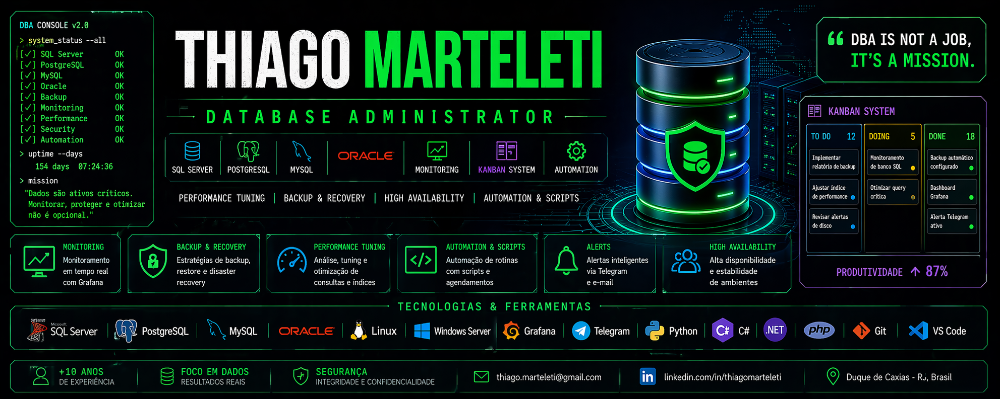

<!-- TERMINAL ANIMADO -->

  

<!-- BANNER -->

<h2>🧠 Sobre mim</h2>

💻 Profissional de TI com +10 anos de experiência em ambientes críticos, principalmente na área da saúde. 
🚀 Focado em <b>Administração de Banco de Dados (DBA)</b>.

<pre>
&gt; SQL Server em produção
&gt; Monitoramento e performance tuning
&gt; Backup, Restore e Disaster Recovery
&gt; Automação e observabilidade
</pre>

<h2>⚙️ Tech Stack</h2>

<h3>🗄️ Databases</h3>

  

<h3>💻 Development</h3>

  

<h3>📊 Monitoring & Tools</h3>

<h2 align="center">📊 GitHub Stats</h2>

 

<h2>📈 Activity Graph</h2>

<h2>🏗️ Projetos</h2>

<h3>📊 DBGrower</h3>
<pre>
&gt; Monitoramento de banco SQL Server
&gt; Expansão automática
&gt; Alertas via Telegram
&gt; Logs e agendamento
</pre>

<h3>🛠️ TecnoOS</h3>
<pre>
&gt; Sistema de ordens de serviço
&gt; Gestão de clientes e equipamentos
&gt; Geração de PDF
&gt; Evoluindo para ASP.NET Core + PostgreSQL
</pre>

<h3>📌 KAN - Sistema de Gestão Kanban</h3>
<pre>
&gt; Plataforma de gerenciamento de projetos estilo Trello/Jira
&gt; Controle visual de tarefas e fluxo de trabalho
&gt; Backend em PHP (MVC)
&gt; Banco de dados MySQL
&gt; Foco em performance, usabilidade e escalabilidade
&gt; Estrutura preparada para evolução (API + versão web avançada)
</pre>

<h3>📡 Monitoring + Grafana</h3>
<pre>
&gt; Dashboards em tempo real
&gt; Alertas automáticos
&gt; Observabilidade completa
</pre>

<h2>📜 Certificações</h2>

<pre>
+ Scrum Foundation
+ DevOps Essentials
+ Oracle Cloud Data Management
+ Neo4j Certified
+ ISO 27001 Foundation
+ Teradata DBA
+ Astronomer Airflow
</pre>

<h2>📫 Contato</h2>

📧 thiago.marteleti@gmail.com

<h2>⚡ Filosofia</h2>

<pre>
SELECT 'DBA IS NOT A JOB, IT''S A MISSION';
</pre>

 

